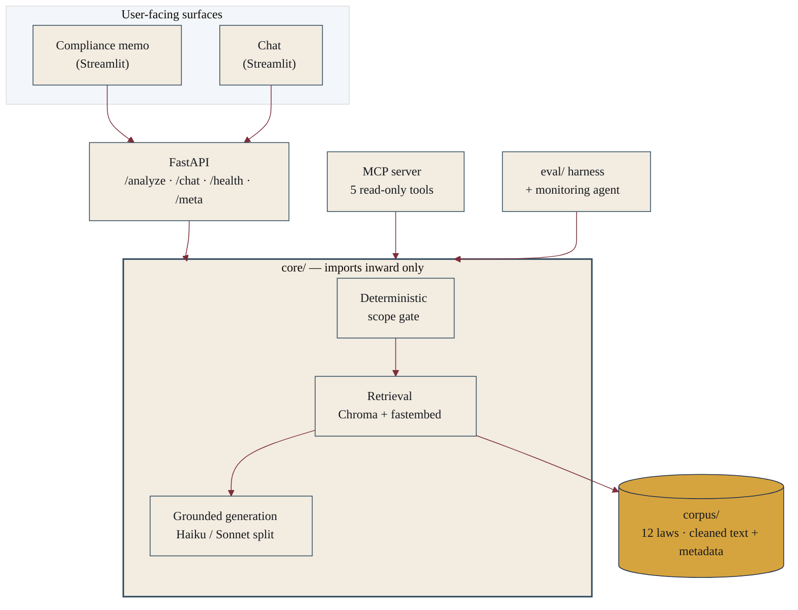
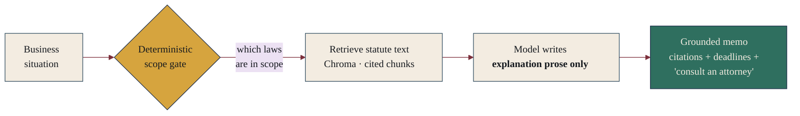

<div align="center">

# Patchwork Assurance

**An AI-native way to read the state-by-state patchwork of US AI-regulation law — grounded in the actual statutory text, with citations, never harmonized into a single fake rule.**

<br>

[](https://github.com/sjtroxel/Patchwork-Assurance/actions/workflows/ci.yml)
[](tests/)
[](pyproject.toml)
[](#the-corpus)
[](LICENSE)

[](https://fastapi.tiangolo.com/)
[](https://streamlit.io/)
[](https://www.trychroma.com/)
[](https://www.anthropic.com/)
[](#use-it-as-an-mcp-tool)

**[Launch the tool](https://app.patchworkassurance.com)** &nbsp;·&nbsp;
**[Landing page](https://patchworkassurance.com)** &nbsp;·&nbsp;
**[API docs](https://api.patchworkassurance.com/docs)** &nbsp;·&nbsp;
**[Roadmap](docs/ROADMAP.md)**

</div>

> [!IMPORTANT]
> **This is an educational / portfolio tool — not a compliance product and not legal advice.**
> The relevant laws are new, unlitigated, and subject to agency rulemaking; the federal picture is in
> flux. "Patchwork Assurance" means *reasonable* assurance — the auditor's term that disclaims absolute
> assurance — never certainty. Consult a licensed attorney for any actual compliance decision.

---

## The problem

AI regulation in the US is arriving state by state, not from Washington. Colorado, Connecticut,
Illinois, California, New Jersey, New York City, and Texas have already passed laws or rules — each with
its **own operative test** and its **own staggered effective dates** — and more states are drafting
theirs. There is no single rulebook, just a growing patchwork.

The hard part is not finding the laws. It is knowing **which pieces touch a given situation**, and
**what the text actually requires** once they do — without flattening seven different legal standards
into one comfortable-sounding but wrong answer.

## What it does

Two surfaces over **one shared, grounded retrieval core**:

| Surface | What you give it | What you get back |
|---|---|---|
| **Compliance memo** | A description of a business situation | A structured educational memo: which laws appear in scope, what each statute requires, the relevant deadlines, and where a licensed attorney should be consulted. A **deterministic scope screen** decides applicability from the facts; the model only writes the explanation prose. |
| **Chat** | A question about the covered laws | An answer drawn from the **retrieved statute text with citations** — not from a model's general impression of the law. It flags contested or unlitigated interpretations and points situation-specific questions to the memo. |

Both read from the same core, so a claim made in chat and a claim made in a memo come from the **same
statute text and the same citations**.

## How it's built

The design choices are the point of the project.



A few invariants are load-bearing:

- **Statutes are never hardcoded.** Every law is a cleaned text file plus a metadata record in
  `corpus/`. One loader ingests the whole folder; retrieval and memo logic are **generic over N
  statutes**, with no per-jurisdiction branches. Adding a state is dropping in a file pair and
  re-running the loader — not changing code.
- **The `core/` package imports inward only.** `core` never imports from `api/` or `ui/`. The API, the
  eval harness, and the monitoring agent all call the **same** retrieval path, so what is tested is
  what runs in production.
- **Stateless by design.** No auth, no database, no saved history. Each analysis runs in-session and is
  discarded. Statelessness is the privacy feature (*"we don't store your inputs"*), not a missing one.
- **Grounded, with the citation attached.** Text is chunked **structure-first** (on statute
  section/subsection) so every chunk carries its own citation. The same embedding model is asserted at
  ingest and query time, because a mismatch silently returns *nothing* rather than erroring.
- **Each law's operative term is preserved, not harmonized** — see [below](#the-operative-terms-rule).

## How a memo is built

The deterministic gate decides *whether* a law applies; the model only writes the *explanation*. That
split is what keeps the output grounded and keeps the tool from overclaiming.



## The corpus

v1 is deployed and works end to end, hosted on Railway. The corpus covers **twelve laws across seven
jurisdictions**, each kept in its own operative terms.

<div align="center">

[](#the-corpus)
[](#the-corpus)
[](#the-corpus)
[](#the-corpus)
[](#the-corpus)
[](#the-corpus)
[](#the-corpus)

</div>

| Jurisdiction | Law | Citation | Operative trigger |
|---|---|---|---|
| Colorado | AI Act (SB 26-189) | C.R.S. §§ 6-1-1701 et seq. (Part 17) | covered ADMT **"materially influences"** a consequential decision |
| Colorado | Privacy Act (CPA) | C.R.S. §§ 6-1-1301 et seq. (Part 13) | profiling in furtherance of decisions with legal / similarly significant effects |
| Connecticut | SB 5 (PA 26-15) | Conn. Pub. Act 26-15 | AERDT is a **"substantial factor"** in an employment decision |
| Connecticut | Data Privacy Act (CTDPA) | Conn. Gen. Stat. §§ 42-515 et seq. | profiling → "any automated decision" (as amended by SB 1295) |
| Illinois | HB 3773 (PA 103-0804) | 775 ILCS 5/2-101 et seq. | AI use that **results in** employment discrimination |
| Illinois | AI Video Interview Act (AIVIA) | 820 ILCS 42/1 et seq. | AI analysis of applicant video interviews → notice, consent, 30-day deletion |
| California | FEHA ADS regs | 2 CCR §§ 11008 et seq. | automated-decision system that discriminates (employment) |
| California | CCPA ADMT regs | 11 CCR §§ 7200 et seq. | ADMT used to make a "significant decision" |
| New York City | Local Law 144 | N.Y.C. Admin. Code §§ 20-870 et seq. | AEDT bias-audit + candidate notice |
| New Jersey | DCR rules | N.J.A.C. §§ 13:16-1.1 to 13:16-6.2 | **disparate impact** (effect-based, reaches AEDTs) |
| New Jersey | Data Privacy Act (NJDPA) | N.J.S.A. §§ 56:8-166.4 et seq. | profiling in furtherance of decisions with legal / similarly significant effects |
| Texas | TRAIGA (HB 149) | Tex. Bus. & Com. Code §§ 551–554 | AI used with **intent** to unlawfully discriminate (disparate impact alone not enough) |

The corpus is designed to grow as the patchwork grows. Adding a jurisdiction is a data change, not a
code change.

> [!NOTE]
> Statute text always comes from the **official source**, never an LLM. A model may help *clean*
> formatting; it never authors or paraphrases the law. Every record carries its `source_url` and
> `retrieved_on`, and the metadata validates against a Pydantic model or fails loudly at load time.

### The operative-terms rule

The single most important legal-engineering decision: **these laws do not share a test, and the tool
never pretends they do.** Colorado's AI Act turns on "materially influence"; Connecticut's SB 5 on
"substantial factor"; Illinois's HB 3773 on discriminatory *effect*; New Jersey's DCR rules on
*disparate impact*; and Texas's TRAIGA on *intent* — where "a disparate impact is not sufficient by
itself," the opposite pole from the effect-based tests. Alongside those sit a cluster of
**consumer-privacy profiling opt-outs** (Colorado's CPA, Connecticut's CTDPA, New Jersey's NJDPA) and a
**procedural** notice/consent/retention rule (Illinois's AIVIA) that is not a discrimination test at
all.

The tool reads **each statute's own language from metadata** rather than flattening them into a single
standard. A memo that said "these seven laws all require X" would be worse than useless — it would be
confidently wrong.

### Staying current: the national radar

Two layers keep the corpus from going stale, and both **gate on a human** — nothing is auto-ingested.
The Phase 9 monitor watches the URLs of laws *already* tracked (fetch → hash → diff → pull request on a
real change). The Phase 13 **national radar** watches for laws *not yet* tracked: a weekly job searches
LegiScan across all 50 states and Congress for newly enrolled or passed AI-regulation bills, filters by
relevance and status, and opens a GitHub **issue** per candidate for review. It is a radar that
**surfaces candidates for human curation, not a claim to detect every AI law** — keyword recall is lossy
in both directions, and the human issue-gate is a first-class part of the design, the same credibility
boundary as the monitor's pull-request gate. Detection is deterministic Python with **no LLM calls**;
bill data comes from LegiScan (CC BY 4.0), while statute text is always sourced from the official
publication.

## Stack

Python end to end, on purpose (a deliberate GitHub signal — no JS/TS frontend).

- **FastAPI** (`api/`) and **Streamlit** (`ui/`) over a pure-Python **`core/`**.
- **Chroma** (local, persistent) for vectors behind a thin retrieval interface; **fastembed**
  (`BAAI/bge-small`, ONNX) for embeddings; a **Claude Haiku / Sonnet** split for generation (fast +
  cheap for chat, stronger for memos).
- `src/` layout, one installable package. Quality gates are **`ruff`** and **`pytest`** (357 tests),
  run locally via `pre-commit` and in CI.

## Run it locally

```bash
make install          # editable install with dev extras + pre-commit
make dev              # boots FastAPI + Streamlit together (one command)
make test             # pytest
make lint             # ruff lint + format check
```

Requires **Python 3.12+**. Generation runs as an offline stub until `LLM_PROVIDER=anthropic` and
`ANTHROPIC_API_KEY` are set in `.env` — retrieval and the deterministic scope / deadlines are **always
real**, so the whole tool is explorable with zero API spend.

## Use it as an MCP tool

The engine is also exposed as an **MCP server**, so any compatible client (Claude Desktop, Cursor,
Claude Code) can call it as a tool — without a UI.

```bash
make mcp              # run the MCP server over stdio (free tools work with LLM_PROVIDER=stub)
```

| Tool | Cost | What it does |
|---|---|---|
| `list_jurisdictions` | free | Jurisdictions, domains, and roles the corpus covers |
| `check_scope` | free | Deterministic scope screen — which laws apply to this situation |
| `search_corpus` | free | Semantic passage lookup over the statute text, with citations |
| `generate_memo` | Sonnet | Full educational compliance memo as structured output |
| `query_metadata` | Haiku | Factual metadata questions (effective dates, cure periods, scope) |

All tools are **read-only** — the corpus is never mutated over MCP — and every output carries the
not-legal-advice disclaimer.

<details>
<summary><b>Client configuration</b> (add to <code>claude_desktop_config.json</code>)</summary>

Use the absolute path to the venv Python if the client doesn't inherit the project environment:

```json
{
  "mcpServers": {
    "patchwork-assurance": {
      "command": "python",
      "args": ["-m", "patchwork_assurance.mcp.server"],
      "env": { "LLM_PROVIDER": "anthropic", "ANTHROPIC_API_KEY": "sk-ant-..." }
    }
  }
}
```

The three free tools work fully with `LLM_PROVIDER=stub`; the two cost-bearing tools require
`LLM_PROVIDER=anthropic` and a key.

</details>

## Evaluation

Retrieval and generation are backed by an **eval harness** (`eval/`) over a hand-built set of gold
cases, so changes to the corpus or the pipeline are measured, not guessed. The harness runs the **exact
production retrieval path** — an eval that tested a different path would be worthless. A separate
multi-agent memo pipeline (analysts + a reviewer) is the shipped default, chosen because it measurably
improved groundedness and citation accuracy over the single-pass baseline.

Spend is gated behind an explicit confirmation step (`eval/safety.py`) after an early accidental-cost
incident — see [`docs/SPENDING_SAFETY.md`](docs/SPENDING_SAFETY.md).

## Project layout

<details>
<summary><b>Directory map</b></summary>

```
src/patchwork_assurance/
  core/        retrieval, corpus loading, scope, memo + chat logic (imports inward only)
  api/         FastAPI transport: /analyze, /chat (SSE), /health, /meta, /memo-quota
  ui/          Streamlit memo + chat surfaces, shared legal chrome
  mcp/         MCP server: five read-only tools wrapping core/
corpus/        cleaned statute text + metadata records (the only place laws live)
site/          static landing page
eval/          evaluation harness
docs/          ROADMAP, per-phase design + as-built docs, SPEC (data / API contracts)
```

</details>

## A note on the author's angle

The builder holds a **J.D.** (earned over a decade ago, working away from law since). The value that
brings here is narrow and honest: an edge on **reading statutory text and turning it into a grounded
spec** faster than most engineers, paired with the AI-engineering build. It is not a credential claim,
not current legal expertise, and not a claim to practice law. The product says so on every surface, by
design.

## License

Copyright (c) 2026 sjtroxel. All rights reserved. See [`LICENSE`](LICENSE).
